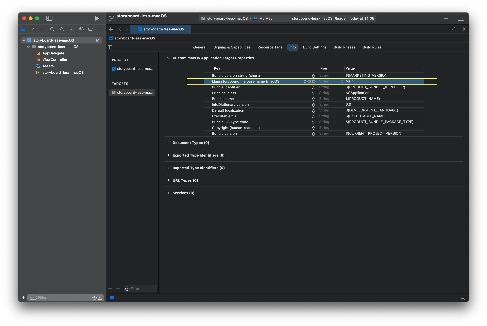
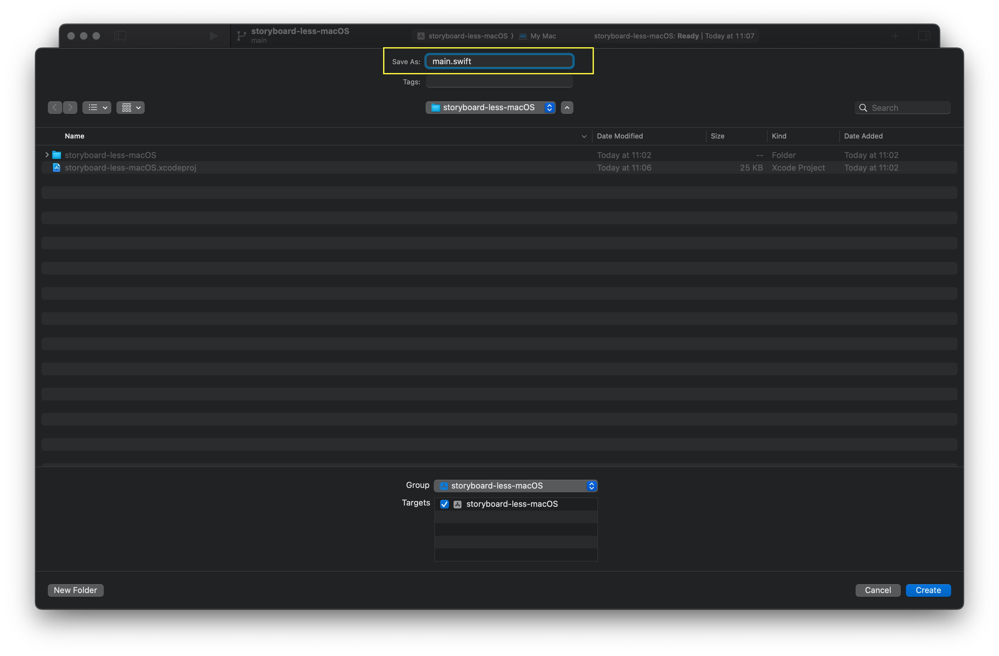
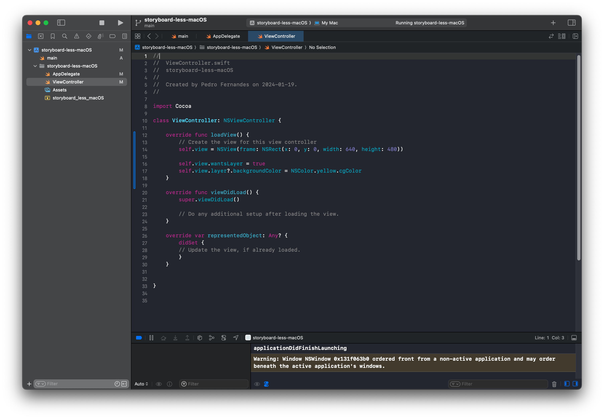

# storyboard-less-macOS

How to create a macOS Xcode project withouth using storyboards

This is based on a writing by Sarunw found here, https://sarunw.com/posts/how-to-create-macos-app-without-storyboard/

Sarun explains how to add SwiftUI content to the Window but I wanted to add a ViewController and coming from iOS I struggled
a bit so I leave you with the steps.

Creating a project without a storyboard has many drawbacks, but, if you like to take charge of every litte detail, welcome.

Do not follow these steps on an existing Xcode project. Use them only when creating a blank project from scratch.

This guide was created for Xcode Version 15.1

- Create a new macOS APP Project

- Delete Main.storyboard file

- Delete Storyboard name from Target -> Info

- Create a new `main.swift`  to tie together NSApplication with your AppDelegate

- This file name is case sensitive

- Modify your `AppDelegate` to create a Window and assign it your `ViewController`

    **Make sure that you comment/delete the `@main` that was used by the storyboard setup**

- Add a function `loadView()` to your `ViewController` to create a `view`. 

    This is critical as unlike iOS this view is not created for you and `viewDidLoad` is not called if you don't have loadView()

We can now run our APP and view the Yellow color of success:

Free as a bird!
